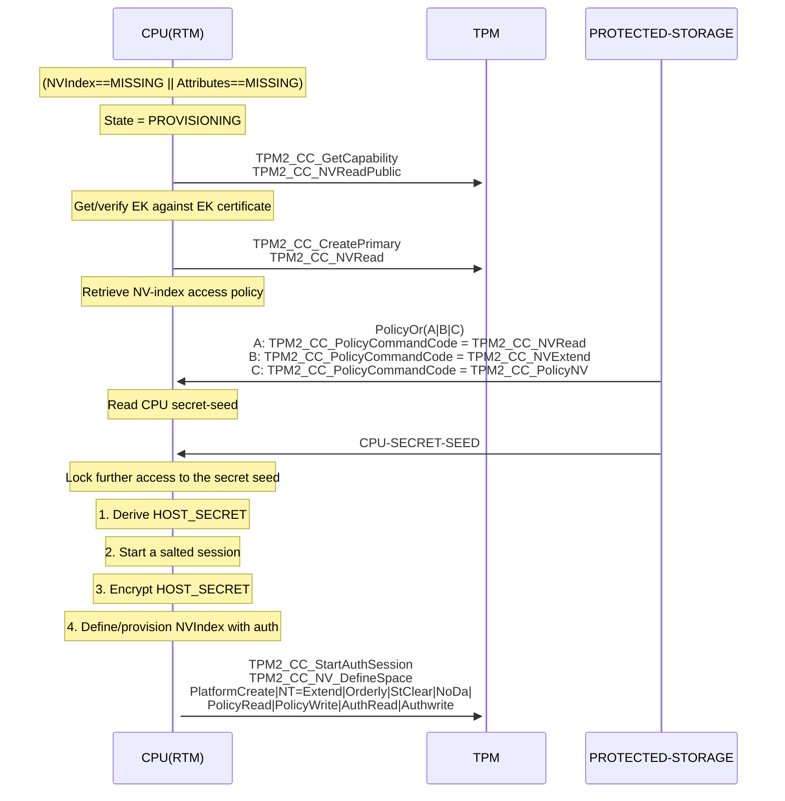
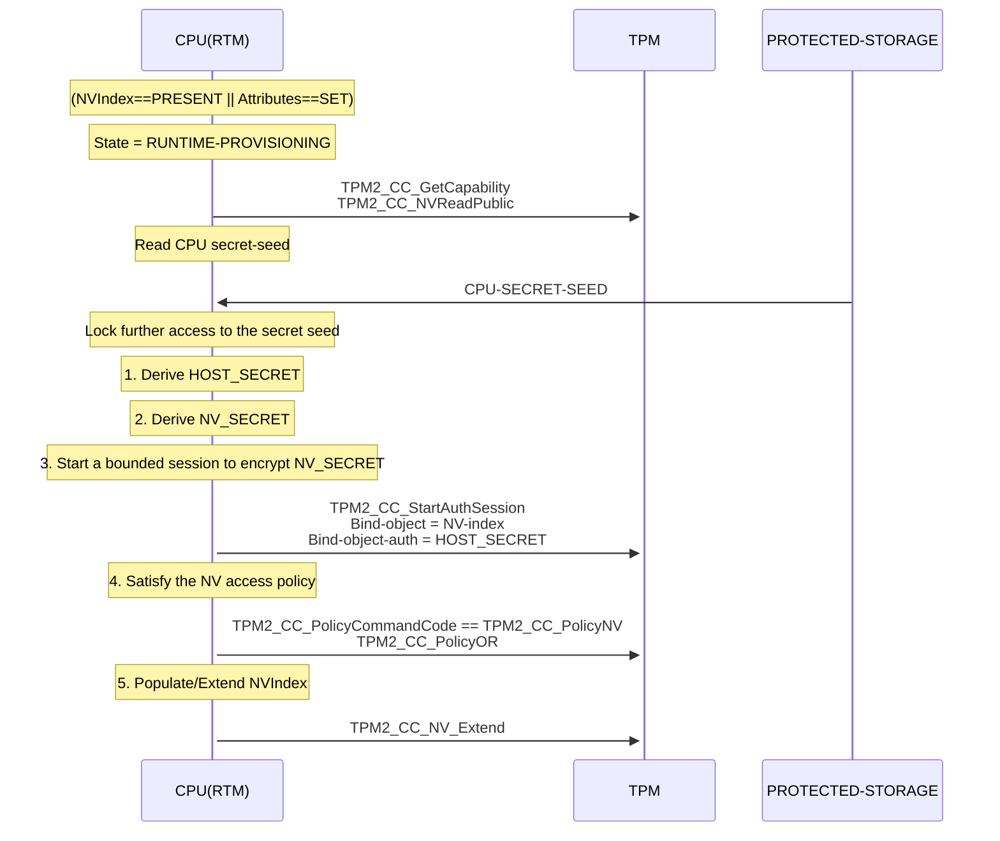
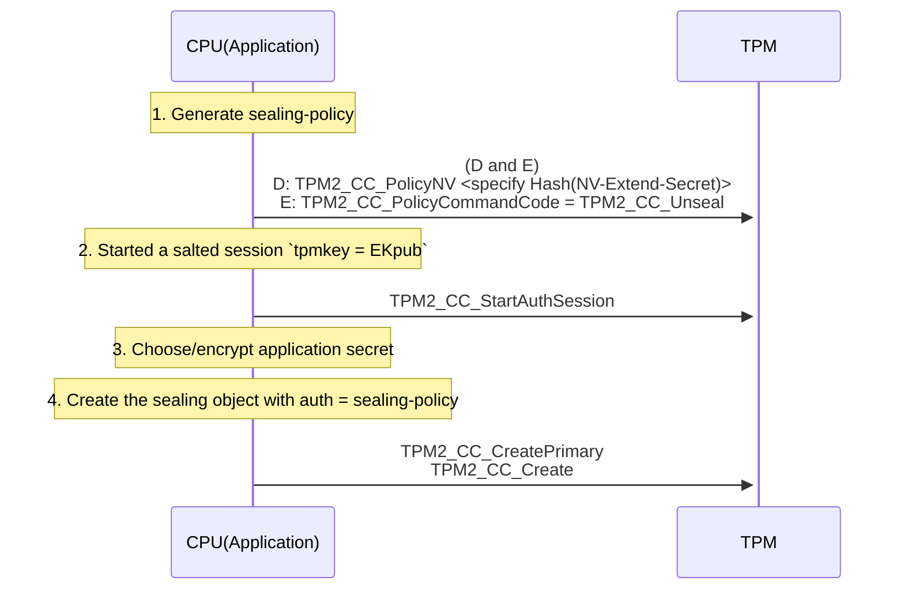
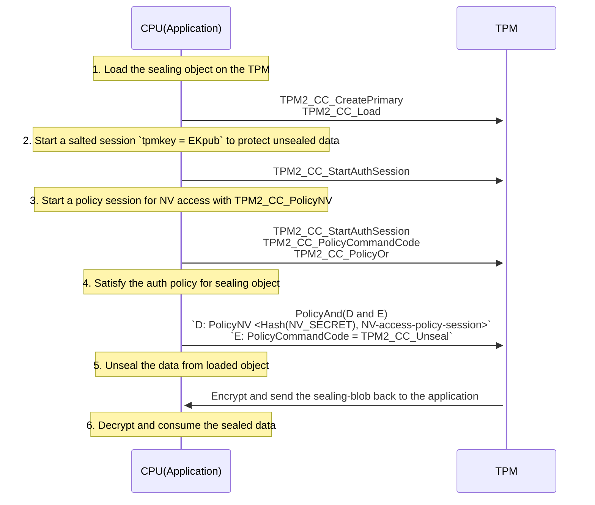

# Protecting secrets at the TPM interface

[Abstract](#abstract)
[Introduction](#introduction)
[Provisioning](#provisioning)
[Runtime extended provisioning](#runtime-extended-provisioning)
[Sealing application secret](#sealing-application-secret)
[Unsealing application secret](#unsealing-application-secret)
[Demonstration script using tpm2-tools](#demonstration-script-using-tpm2-tools)
[Credits](#credits)

#### Abstract

This tutorial demonstrates a method to protect application secrets on the TPM.
TPM's RTS protected-storage guarantees protection of information on the TPM.
This tutorial explains a method to protect the secrets on the interface between
the CPU and the TPM using provisions in the TPM standard.

In the method we discuss the following protections for an application secret:

- The application secret is sealed to a trusted TPM device whose identity is
  known to be valid.

- The TPM device and the CPU are bound with a secret. The authorization policy
  for the sealing object is made dependent on the secret. This offers protection
  against the attacker ability to transplant the TPM to an attacker controlled
  CPU to retrieve the secrets.

- Inhibit the attacker ability to retrieve or replay any of the secrets used
  for the provisioning and the application-secrets on the CPU<==>TPM interface.

#### Introduction

The method works by sealing the application secret to a sealing-object whose
auth policy dictates that the content of an NV index must be the hash of a
secret value that is known only to a CPU.

The rest of the mechanism details the encryption of the sensitive content
transferred between the CPU and the TPM with a verified identity.

There are four distinct steps to the method, namely:

1. Provisioning:
   At this step, the NV index with specific attributes and authorization-value
   and authorization-policy is created by the CPU(RTM).

2. Runtime-extended-provisioning:
   At this step, the NV index of the type “Extend” is extended with the NV
   secret value derived from the CPU known secret.

3. Sealing-data:
   A sealing object is created with the policy-command-code (TPM2_CC_PolicyNV
   AND TPM2_CC_Unseal)

4. Unsealing-data:
   The authorization-policy for unsealing is satisfied and the secret is
   unsealed.

#### Provisioning




#### Runtime extended provisioning




#### Sealing application secret




#### Unsealing application secret




#### Demonstration script using tpm2-tools

```bash
#!/bin/bash
#
# Filename : tpm2-software-secret-protection-demo.sh
# Author   : imran.desai@intel.com, github.com/idesai
#

set -E

tpm-secret-protection-demo-help() {
    echo "
    #
    # Flows:
    #
    # RTM checks for the NVIndex and its properties and triggers either:
    #
    # (1) cpu_secret_provisioning : Creates NVIndex with required auths & attributes
    #             OR
    # (2) runtime_provisioning    : Extends NVIndex with data only known to the CPU
    #
    # Applications can now reference the NVIndex in a PolicyNV and perform either:
    #
    # (1) seal_data               : Create a sealing object and seal data
    #
    # (2) unseal_data             : Load the sealing object and unseal data
    #
    #
    # NOTE: Source this script to avail all the functions
    "
}

#
# Globals
#
# The NV index should ideally be created as a platform hierarchy object
NVIndex=0x1500018

# This is one of the two secrets derived from a seed value ideally accessible
# only to the CPU. This serves as the NV index auth that can be used as bind obj
HOST_SECRET="host-secret"

# This is the second secret derived from a seed value ideally accessible
# only to the CPU. When extended to the NV index, a hash of this value can be
# used in PolicyNV to authorize unsealing of application secret. Only a CPU with
# access to the HOST_SECRET will be able to extend the required value.
NV_SECRET="nv-secret"

# The application secret to be sealed to the TPM. So long as the CPU extends the
# required NV_SECRET value to the TPM, the unsealing operation is allowed.
SEALBLOB="app-secret"

cleanup() {

    tpm2_clear -Q
    tpm2_nvreadpublic | grep -q $NVIndex
    if [ $? == 0 ]; then
        tpm2_nvundefine -Q -C p $NVIndex
    fi
    rm -f ek.ctx salted_session.ctx policycc_nv_session.ctx A.policy B.policy \
    C.policy nvaccess_policy_generation_session.ctx nvaccess.policy \
    bounded_policy_session.ctx unseal_policy_generate_session.ctx \
    unseal.policy oprim.ctx seal_obj.ctx nvread_session.ctx
}

trap cleanup EXIT

#
# Salted session for encrypting sensitive information when:
# 1. Creating the NV index
# 2. Creating the sealing object
# 3. Unsealing the application secret
#
setup_salted_param_encrypt_session_with_ek() {

    tpm2_createek -Q --key-algorithm rsa --ek-context ek.ctx

    tpm2_startauthsession -Q  --session salted_session.ctx $1 \
    --tpmkey-context ek.ctx
    rm -f ek.ctx

    tpm2_sessionconfig -Q  salted_session.ctx --enable-decrypt
}

#
# Starting the PolicyNV policy session required when:
# 1. Generating the policy for the sealing object at creation
# 2. Unsealing the application secret
#
nvaccess_policycc_policynv() {

    tpm2_startauthsession -Q --session policycc_nv_session.ctx --policy-session

    tpm2_policycommandcode -Q --session policycc_nv_session.ctx TPM2_CC_PolicyNV

    tpm2_policyor -Q --session policycc_nv_session.ctx \
    --policy-list sha256:A.policy,B.policy,C.policy
}

#
# Generate the policy paths for accessing read/ write operations on NV index
# A.policy ==> PolicyCommandCode = TPM2_CC_NV_Read
# B.policy ==> PolicyCommandCode = TPM2_CC_NV_Extend
# C.policy ==> PolicyCommandCode = TPM2_CC_PolicyNV
# Access-Policy = A||B||C
#
generate_nv_access_policy() {

    tpm2_startauthsession -Q --session nvaccess_policy_generation_session.ctx

    tpm2_policycommandcode -Q TPM2_CC_NV_Read --policy A.policy \
    --session nvaccess_policy_generation_session.ctx

    tpm2_flushcontext -Q nvaccess_policy_generation_session.ctx

    tpm2_startauthsession -Q --session nvaccess_policy_generation_session.ctx

    tpm2_policycommandcode -Q  TPM2_CC_NV_Extend --policy B.policy \
    --session nvaccess_policy_generation_session.ctx

    tpm2_flushcontext -Q nvaccess_policy_generation_session.ctx

    tpm2_startauthsession -Q --session nvaccess_policy_generation_session.ctx

    tpm2_policycommandcode -Q TPM2_CC_PolicyNV --policy C.policy \
    --session nvaccess_policy_generation_session.ctx

    tpm2_flushcontext -Q nvaccess_policy_generation_session.ctx

    tpm2_startauthsession -Q --session nvaccess_policy_generation_session.ctx

    tpm2_policyor -Q --session nvaccess_policy_generation_session.ctx \
    --policy-list sha256:A.policy,B.policy,C.policy --policy nvaccess.policy

    tpm2_flushcontext -Q nvaccess_policy_generation_session.ctx

    rm -f nvaccess_policy_generation_session.ctx
}

#
# This provisioning step is done once under RTM control
#
cpu_secret_provisioning() {
    generate_nv_access_policy

    setup_salted_param_encrypt_session_with_ek --hmac-session

    tpm2_nvdefine -Q  --session salted_session.ctx -C p -p $HOST_SECRET $NVIndex \
    -a "orderly|clear_stclear|platformcreate|no_da|nt=extend|policyread|policywrite|authread|authwrite" \
    --policy nvaccess.policy

    tpm2_flushcontext -Q salted_session.ctx
    rm -f salted_session.ctx nvaccess.policy
}

#
# This step is done once at every TPM restart under RTM control
# Satisfy policy to be able to extend the NV index in bounded policy session
# Note: Auth specified in the bounded session generation is used to
#       calculate the sessionvalue by ESAPI. The auth is not exposed on
#       TPM interface.
#
runtime_provisioning() {
    tpm2_startauthsession -Q  --session bounded_policy_session.ctx \
    --policy-session --bind-context $NVIndex --bind-auth $HOST_SECRET

    tpm2_sessionconfig -Q bounded_policy_session.ctx \
    --enable-decrypt --enable-encrypt

    tpm2_policycommandcode -Q --session bounded_policy_session.ctx \
    TPM2_CC_NV_Extend

    tpm2_policyor -Q --session bounded_policy_session.ctx \
    --policy-list sha256:A.policy,B.policy,C.policy

    echo -n $NV_SECRET|tpm2_nvextend -Q -C $NVIndex -i- $NVIndex \
    -P session:bounded_policy_session.ctx

    tpm2_flushcontext -Q bounded_policy_session.ctx
    rm -f bounded_policy_session.ctx
}

#
# Satisfy policy to be able to read the NV Index
#
nvread_session_setup() {
    tpm2_startauthsession -Q --session nvread_session.ctx --policy-session

    tpm2_policycommandcode -Q --session nvread_session.ctx TPM2_CC_NV_Read

    tpm2_policyor -Q --session nvread_session.ctx \
    --policy-list sha256:A.policy,B.policy,C.policy
}

#
# Sealing-object-policy:
# PolicyCommandCode == (TPM2_CC_PolicyNV && TPM2_CC_Unseal)
#
seal_data() {

    nvaccess_policycc_policynv

    tpm2_startauthsession -Q --session unseal_policy_generate_session.ctx

    nvread_session_setup

    tpm2_nvread $NVIndex -P session:nvread_session.ctx | tpm2_policynv -Q -i- \
    $NVIndex eq --session unseal_policy_generate_session.ctx \
    -P session:policycc_nv_session.ctx --policy unseal.policy 

    tpm2_flushcontext -Q policycc_nv_session.ctx
    tpm2_flushcontext -Q nvread_session.ctx
    rm -f policycc_nv_session.ctx
    rm -f nvread_session.ctx

    tpm2_policycommandcode -Q --session unseal_policy_generate_session.ctx \
    --policy unseal.policy TPM2_CC_Unseal

    tpm2_flushcontext -Q unseal_policy_generate_session.ctx
    rm -f unseal_policy_generate_session.ctx

    setup_salted_param_encrypt_session_with_ek --hmac-session

    tpm2_createprimary -Q  -C o -c oprim.ctx

    echo -n $SEALBLOB | tpm2_create -Q  -C oprim.ctx --policy unseal.policy \
    -u seal_obj.pub -r seal_obj.priv --session salted_session.ctx -i-
    rm -f oprim.ctx
    rm -f unseal.policy

    tpm2_flushcontext -Q salted_session.ctx
    rm -f salted_session.ctx
}

load_sealing_object() {
    tpm2_createprimary -Q  -C o -c oprim.ctx

    tpm2_load -Q  -C oprim.ctx -c seal_obj.ctx -u seal_obj.pub -r seal_obj.priv
    rm -f oprim.ctx
}

#
# 1. Read NV index <non secret data>
# 2. Satisfy PolicyNV
# 3. Unseal
#
unseal_data() {

    nvaccess_policycc_policynv

    setup_salted_param_encrypt_session_with_ek --policy-session

    nvread_session_setup

    tpm2_nvread -C $NVIndex -P session:nvread_session.ctx $NVIndex | \
    tpm2_policynv -Q -i- $NVIndex eq --session salted_session.ctx \
    -P session:policycc_nv_session.ctx 

    tpm2_flushcontext -Q policycc_nv_session.ctx
    tpm2_flushcontext -Q nvread_session.ctx
    rm -f policycc_nv_session.ctx
    rm -f nvread_session.ctx

    tpm2_policycommandcode -Q --session salted_session.ctx TPM2_CC_Unseal

    load_sealing_object

    UNSEALBLOB=$(tpm2_unseal -Q -c seal_obj.ctx -p session:salted_session.ctx)

    echo "UNSEALBLOB=$UNSEALBLOB"

    tpm2_flushcontext -Q salted_session.ctx
    rm -f seal_obj.ctx
}

tpm-secret-protection-demo-help
```

## Credits

This document is a culmination of thoughts and ideas of the members of the TCG
Device Driver Working Group (DDWG). Thanks to the contributors:

- Liran Perez(Intel)
- Ken Goldman (IBM)
- Ronald Aigner (Microsoft)
- Amy Nelson (Dell)
- Imran Desai (Intel)
