---
# Feel free to add content and custom Front Matter to this file.
# To modify the layout, see https://jekyllrb.com/docs/themes/#overriding-theme-defaults

layout: page
title: ""
---

# Welcome to the tpm2-software community page.

This is the come for information related to the use of the TPM2 using the TPM2
Software Stack. We collect links to [software](https://tpm2-software.github.io/software/)
that already contains support for TPM2 as well as ideas for [software](https://tpm2-software.github.io/software/)
the might benefit from TPM2 support. We provide links to [external](https://tpm2-software.github.io/external/)
/ educational resources as well as [tutorials](https://tpm2-software.github.io/tutorials/)
on how to work with the TPM2.

The core software of this community can be found at
- [https://github.com/tpm2-software](https://github.com/tpm2-software)

The mailing list for this community can be found at
- [https://lists.01.org/mailman/listinfo/tpm2](https://lists.01.org/mailman/listinfo/tpm2)

# Contributing

Contributions to this site are always wanted and highly welcome -- from
additional links to full-blown tutorials. Please feel free to fork and send
merge requests on GitHub
- [https://github.com/tpm2-software/tpm2-software.github.io](https://github.com/tpm2-software/tpm2-software.github.io)

Also each of the core and non-core project has a lot of enhancement issues that
are great for getting started in their issue trackers.

# TPM2 Software Stack

